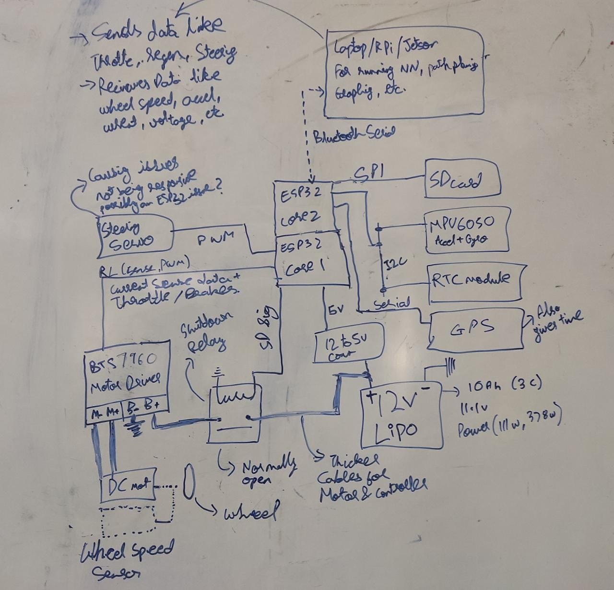

# VRE_VCU



## TODO: Autonomous RC Car

1. Rear motor and gearbox is slipping, disassemble it
2. Wiring Harness - Disconnector between top and bottom units
3. Wiring Harness - All wires running along chassis, minimum length
4. Tractive System LEDs strip installation
5. Steering Servo not responding correctly - likely due to ESP32 PWM issue. Resolve by simplifying code or using an intermediate Arduino /  PWM generator.
6. Power Calculation (watts) - look at ESP32, Motor+Controller, relays, GPS, IMU, etc. power consumption and add it up. Divide 111 watt by power consumption to estimate runtime in hours.
7. Current Limits - The BTS7960 Motor Driver has current sense leads which have been read into `CURRENT_DRAW_L` and `CURRENT_DRAW_R` ranging (0, 4095). Understand what the value represents and convert it into current in Amps
8. Battery Voltage Sensing and enforcing voltage limits by opening shutdown relay 
9. GPS - The module does not send location properly, although it does send the correct time. Debug and fix
10. Data Compression - Comp->Vehicle data is compressed to 4 bytes ;  similarly compress the Vehicle->Comp data (right now it a comma seperated string)
11. (Optional) Redesign PCB
12. (Optional) Wiring Harness - High current paths (motor lines, motor controller lines) to have thicker wires
13. (Optional) Remaining Runtime Estimation - Look at current battery voltage, average current draw over the last X minutes and compute average power (watt) over the last X seconds. With with the average power and known capacity of the battery (10 Ah), compute an estimated remaining runtime in minutes
14. (Optional) Range Estimation - Look at average energy consumed per distance travelled (units watt-hour per meter) draw over the last X minutes and with the known capacity of the battery (10 Ah), compute an estimated remaining runtime in minutes and remaining range in meters
15. (Optional) Wheel Speed sensing - build and test sensor + code to measure wheel speed encoder count

## Data format

Incoming data fromat is 4 bytes of the following format

```python
b0 = ord(';')
b1 =    self.shutdown<<7        ^ 
        self.parity<<6          ^ 
        self.log<<5             ^ 
        self.regen<<4           ^ 
        self.left<<1            ^ 
        self.reverse<<0
b2 = self.throttle
b3 = self.steering

bytearray([b0, b1, b2, b3])
```

Outgoing data format is of the following format

```python
# TODO : Compress the following into binary format similar to 'incoming data format'
"""
GPS
	LAT
	LON
	TIME

GYRO
ACCEL
	VELOCITY	# Integrate ACCEL
	POSITION	# Integrate POSITION (Only since last GPS Ping)

THROTTLE		# Negative throttle produces braking force
STEERING
REGEN			# Regenerative Braking

CURRENT_LIMIT		# Set current limit
SHUTDOWN_STAT		# Shutdown relay status

BAT_VOLTAGE		# 11.1v Lipo battery voltage
MOT_CURRENT		# Current Draw from motor
"""
```

## TODO: Software 
1. Data logging with dates
2. Wireless live data streaming 
3. Servo Steering issue (Maybe use another controller for servo PWM)
4. ESP32 PWM issue using multiple libs that implement their own version of PWM, rewrite this
5. MPU Connection hang bug (system waits forever to connect to MPU)
6. SD card consistency issue

## TODO: PCB
1. PCB - level shifter shape and pinout
2. PCB - Power connector is to be reversed
3. PCB - SD Card Mount Orientation
4. PCB - Add shutdown relays
5. PCB - Add BSPD daughter board
6. PCB - ESP32 [Look at Strapping Pins] Error message - :A fatal error occurred: MD5 of file does not match data in flash!" - Disconnecting pin 12 from the level shifter fixed this
7. PCB - RTC and MPU are too close to each other
8. PCB - Add termination resistor of either 60 Ohm or 120 Ohm to CAN (60 seems to work)

## Strapping Pins

The strapping pins must not be pulled high/low on boot. The ESP32 chip has the following strapping pins:

- GPIO 0
- GPIO 2
- GPIO 4
- GPIO 5 (must be HIGH during boot)
- GPIO 12 (must be LOW during boot)
- GPIO 15 (must be HIGH during boot)

## Libraries used :

- ["ESP32CAN.h"](https://www.arduino.cc/reference/en/libraries/can/) CAN
- ["Wire.h"](https://www.arduino.cc/en/reference/wire) Requirement for `SPI.h`
- ["I2Cdev.h"](http://github.com/jrowberg/i2cdevlib) IIC to talk to MPU6050 and DS3231 (RTC Clock)
- ["./DS1307.h"](https://github.com/jrowberg/i2cdevlib/tree/master/Arduino/DS1307)
- ["./MPU6050.h"](https://github.com/jrowberg/i2cdevlib/tree/master/Arduino/MPU6050)
- ["FS.h"](https://github.com/espressif/arduino-esp32/blob/master/libraries/FS/src/FS.h)
- ["SD.h"](https://github.com/espressif/arduino-esp32/blob/master/libraries/SD/src/SD.h)
- ["SPI.h"](https://github.com/espressif/arduino-esp32/tree/master/libraries/SPI) SPI to talk to SD card
- ["TinyGPS++.h"][]

Refer to [AdityaNG/VRE_CAN](https://github.com/AdityaNG/VRE_CAN) for CAN Data logger implementation.
