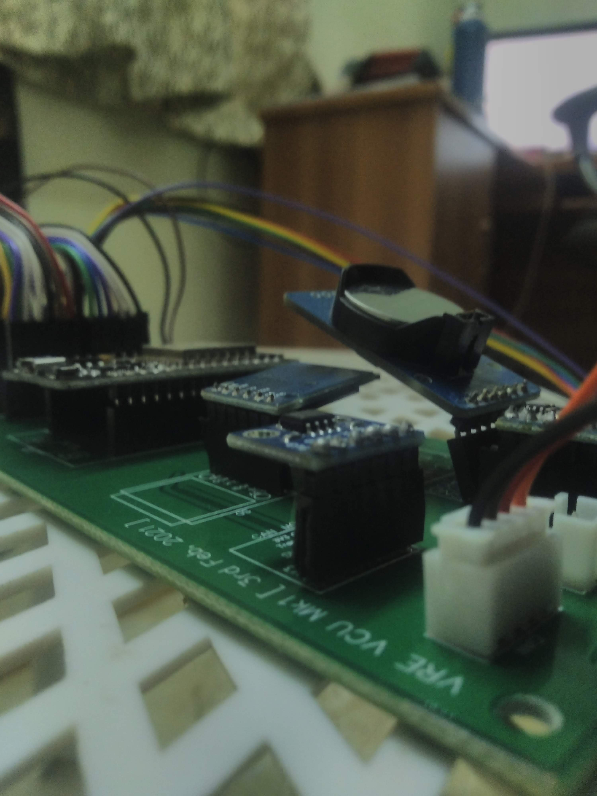

# VRE_VCU

The VCU handles the following tasks : 

1. Listening to throttle pedal, brake pressure, wheel speed, start button, other dash buttons
2. Generating appropriate throttle signal, RTDS, dispaly data, APPS plausibility check, work on shutdown circuit
3. Data logging, wireless live logging, Remote Emergency Shutdown, etc. 

## TODO: Software 
1. Data logging with dates
2. Wireless live data streaming 
3. Servo Steering issue (Maybe use another controller for servo PWM)
4. ESP32 PWM issue using multiple libs that implement their own version of PWM, rewrite this
5. MPU Connection hang bug (system waits forever to connect to MPU)
6. SD card consistency issue

## TODO: PCB
1. PCB - level shifter shape and pinout
2. PCB - Power connector is to be reversed
3. PCB - SD Card Mount Orientation
4. PCB - Add shutdown relays
5. PCB - Add BSPD daughter board
6. PCB - ESP32 [Look at Strapping Pins] Error message - :A fatal error occurred: MD5 of file does not match data in flash!" - Disconnecting pin 12 from the level shifter fixed this
7. PCB - RTC and MPU are too close to each other
8. PCB - Add termination resistor of either 60 Ohm or 120 Ohm to CAN (60 seems to work)

## Strapping Pins

The strapping pins must not be pulled high/low on boot. The ESP32 chip has the following strapping pins:

- GPIO 0
- GPIO 2
- GPIO 4
- GPIO 5 (must be HIGH during boot)
- GPIO 12 (must be LOW during boot)
- GPIO 15 (must be HIGH during boot)

## Libraries used :

- ["ESP32CAN.h"](https://www.arduino.cc/reference/en/libraries/can/)
- ["Wire.h"](https://www.arduino.cc/en/reference/wire)
- ["I2Cdev.h"](http://github.com/jrowberg/i2cdevlib)
- ["./DS1307.h"](https://github.com/jrowberg/i2cdevlib/tree/master/Arduino/DS1307)
- ["./MPU6050.h"](https://github.com/jrowberg/i2cdevlib/tree/master/Arduino/MPU6050)
- ["FS.h"](https://github.com/espressif/arduino-esp32/blob/master/libraries/FS/src/FS.h)
- ["SD.h"](https://github.com/espressif/arduino-esp32/blob/master/libraries/SD/src/SD.h)
- ["SPI.h"](https://github.com/espressif/arduino-esp32/tree/master/libraries/SPI)

Refer to [AdityaNG/VRE_CAN](https://github.com/AdityaNG/VRE_CAN) for CAN Data logger implementation.

